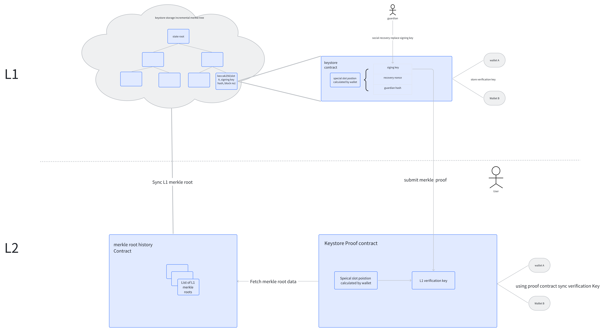
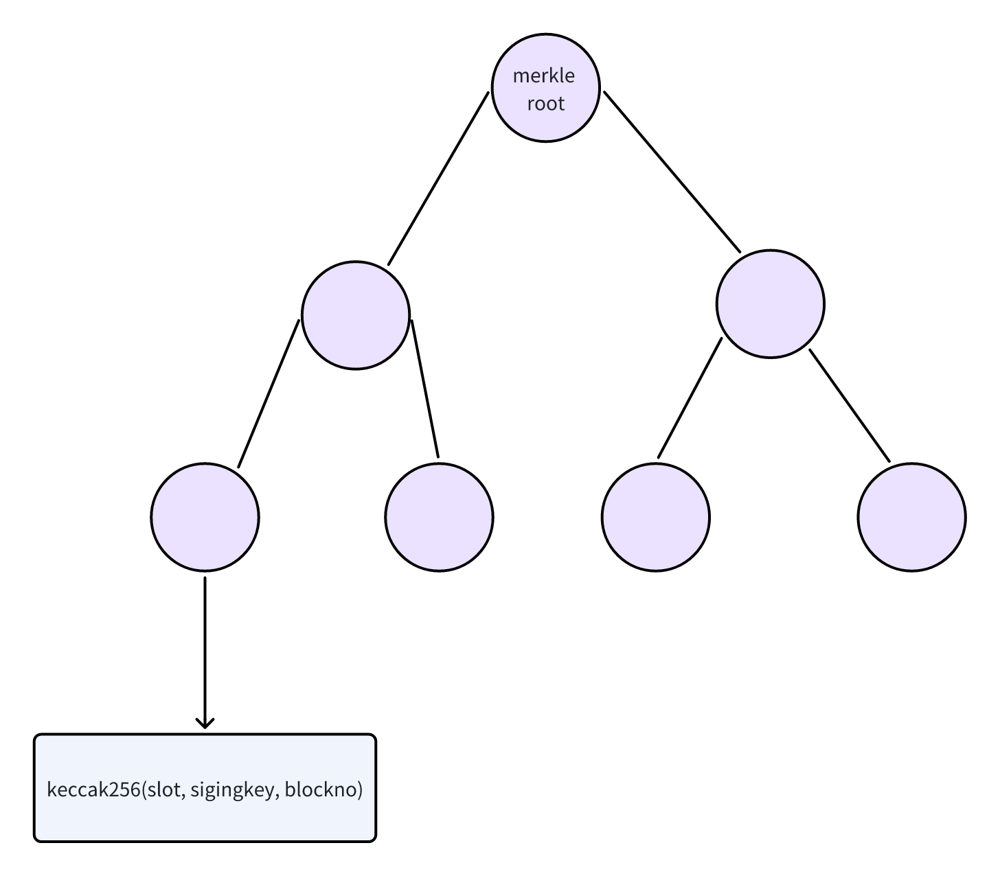
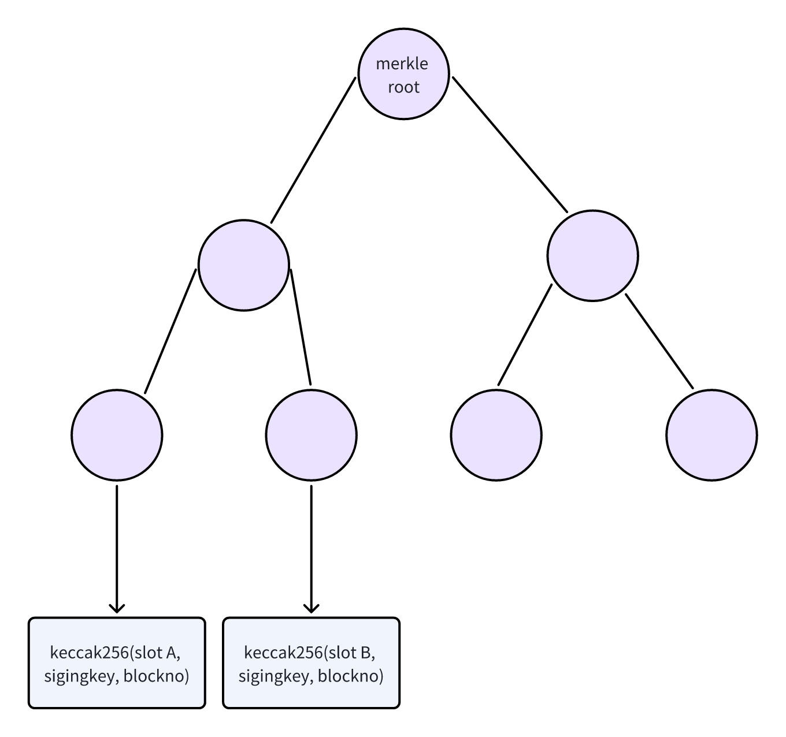
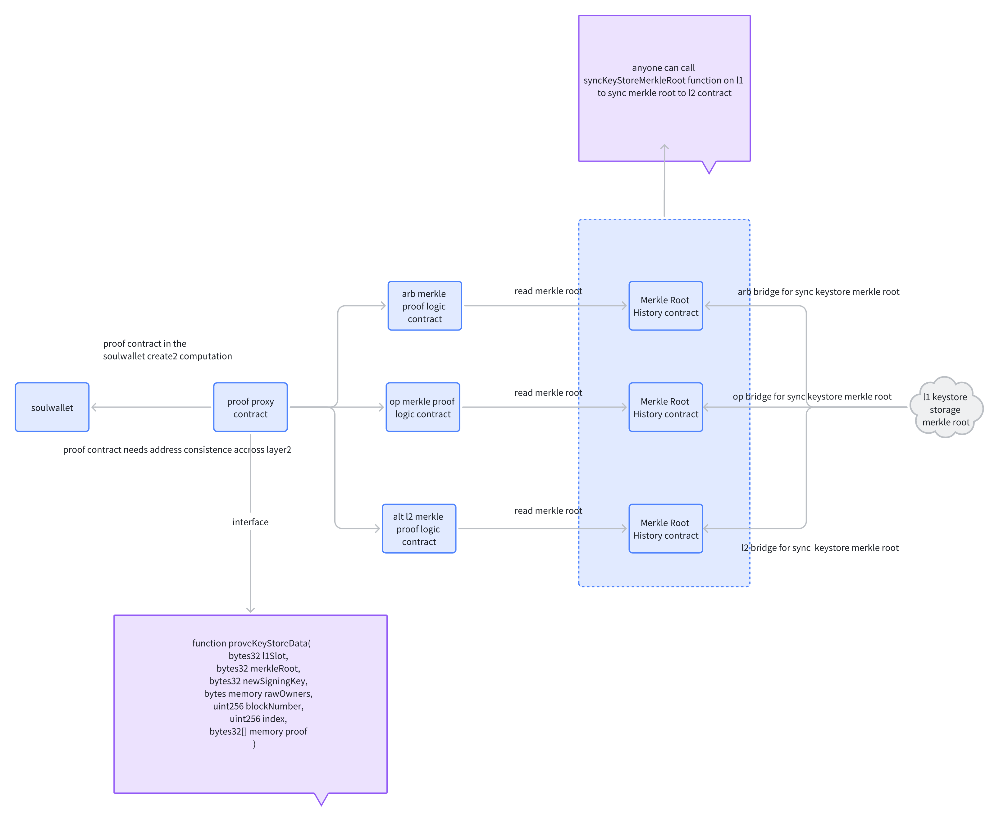
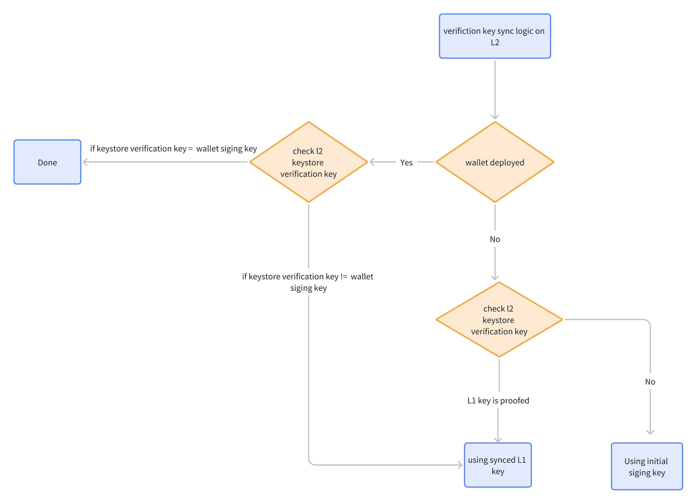

# Keystore Design Overview

The keystore design is aiming to streamline the management of verification keys of the smart contract wallet across Ethereum L1 and L2s. It integrates the separation of verification logic and asset holdings into a single cohesive system. This architecture allows users to maintain their verification keys on the L1 Keystore contract. Wallets created on various L2s can then sync with the latest verification key from the L1 keystore contract, either during the wallet's creation or after its deployment.

Furthermore, the keystore desgin provides significant advantages for guardians managing recovery operations. They are no longer required to sign messages on each chain to recover a user's wallet. Instead, all guardian management operations are conducted on L1 only, which significantly reduces complexity and increases manageability. This architecture negates the need to consider whether the guardian's address is deployed or usable across different L2s.

## SoulWallet Keystore Architecture



### Keystore Contract on L1

The L1 keystore comprises three main contract components, ensuring efficient and secure data management and synchronization across layers:

1. **Keystore Logic Contract**: Manages keystore operations, including signing key modifications and keystore configuration parameters by owner or guardians.
2. **Keystore Storage Contract**: Acts as the primary data repository, storing user slots, signing keys, and configuration settings.
3. **Cross-Chain Message Synchronization Contract**: Synchronizes the state root of the Incremental Merkle Tree from the Keystore Storage contract across L2 solutions.

#### Keystore Storage Contract

Utilizing the Eternal Storage pattern, this contract employs two-dimensional mappings as a key-value database for user slot and keystore data:

```solidity
// Mapping structure for various data types
mapping(bytes32 => mapping(bytes32 => string)) private stringStorage;
mapping(bytes32 => mapping(bytes32 => bytes)) private bytesStorage;
mapping(bytes32 => mapping(bytes32 => uint256)) private uint256Storage;
mapping(bytes32 => mapping(bytes32 => int256)) private intStorage;
mapping(bytes32 => mapping(bytes32 => address)) private addressStorage;
mapping(bytes32 => mapping(bytes32 => bool)) private booleanStorage;
mapping(bytes32 => mapping(bytes32 => bytes32)) private bytes32Storage;
```

Interfaces for retrieving and updating keystore information include getter and setter functions for efficient interaction with the upper-layer keystore logic contracts.

```solidity
// Getter and setter function examples
  function getAddress(bytes32 _slot, bytes32 _key) external view returns (address);
  function setAddress(bytes32 _slot, bytes32 _key, address _value) external;
```

We have opted for the Eternal Storage pattern as our architectural foundation to facilitate independent upgrades of the keystore logic contract by users in the future. This choice empowers users to retain full control over their keystore logic contract, with the Keystore Storage contract dedicated exclusively to storing data associated with the user's slots. Importantly, the authority to modify data rests with the keystore logic contract. This structure ensures that storage remains persistent and distinctly separated from the business logic, enabling smooth upgrades without risking the integrity of stored data.

A key rationale behind selecting the Eternal Storage pattern over the commonly used proxy upgrade model is the degree of autonomy it offers users regarding future upgrades of the keystore logic contract. Traditional proxy upgrade models typically place the decision to upgrade a contract in the hands of the project team, leaving users with little to no choice in the matter. Given that a keystore represents a critical asset for users, we believe it is paramount that the decision to upgrade lies solely with the user. This approach underscores our commitment to user empowerment and security, ensuring that users have the ultimate say in the evolution of their keystore, in alignment with their individual needs and security requirements.

The Keystore Storage Contract not only serves as the primary repository for user-specific data but also maintains an incremental Merkle tree. This advanced structure is crucial for tracking changes and enhancing the security of the keystore data across Ethereum's Layer 1 and Layer 2 networks.

The contract incorporates an incremental Merkle tree to efficiently manage and authenticate the history of changes, particularly the modifications of signing keys. Each time a signing key is updated (via the setKey function), a new leaf node is created in the Merkle tree. This node contains the hash value derived from the combination of the slot, the new signing key, and the block number at which the modification occurred. This mechanism ensures an immutable and verifiable record of all signing key updates, allowing for secure and efficient synchronization and verification across the network.

The following diagram illustrates an example of the changes in an incremental Merkle tree when modifying two signing keys.




#### Keystore Logic Contract

The primary functionality of the keystore is to allow users, or their guardians, to modify the signing key associated with their slot, as well as various keystore configuration parameters, such as the time lock duration or guardian settings. For the sake of user security, modifications to the guardian configuration are subject to a time lock, the duration of which is determined by the user at initialization.

If a user's signing key needs to be updated by a guardian, the update will take effect immediately once the guardian's signature reaches the keystore's predefined threshold. This mechanism provides users with both flexibility and security, allowing for quick adjustments to their keystore settings or swift responses to security issues as required.

#### Cross-Chain Message Synchronization Contract

Each Layer 2 (L2) network is associated with a specific cross-chain message contract. This contract's main purpose is to synchronize the Merkle root from the keystore storage contract's incremental Merkle tree to the respective Layer 2 network. It is crucial to understand that the cross-chain message synchronization method varies across different L2 networks. Therefore, each L2 network is paired with its unique cross-chain message contract to accommodate these differences.

Merkle Root Synchronization: The cross-chain message contract facilitates the synchronization of the Merkle root from the keystore storage contract to its corresponding Layer 2 network.

Layer2-Specific Implementation: Due to the variance in synchronization methods among different Layer 2 networks, a distinct cross-chain message contract is designated for each L2, ensuring compatibility and efficient communication.

### Keystore Contract on L2



The L2 keystore functionality is managed by three contracts, ensuring secure and up-to-date synchronization with L1:

1. **MerkleRootHistory Contract**: Stores a history of the 30 most recently synchronized Merkle roots from L1.
2. **KeyStoreMerkleProof Contract**: Requires users to submit proof of their L1 keystore signing key for verification.
3. **Keystore Module Contract**: Integrates with the SoulWallet contract, updating the wallet with the latest signing key upon deployment if the keystore has been synchronized.

The logic updates for the keystore module are depicted in the diagram below.



These components ensure a secure, efficient, and user-friendly keystore system across Ethereum L1 and L2 networks, simplifying recovery operations and enhancing overall manageability.
