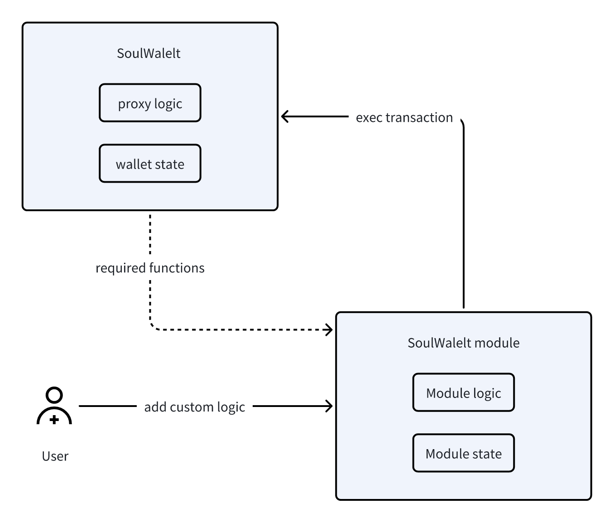

# Module Introduction

SoulWallet modules introduce customizable features to SoulWallet contracts. They are smart contracts designed to extend the functionality of SoulWallet, while keeping module logic distinct from the core contracts of SoulWallet. A basic SoulWallet operates independently of any modules, which are optional and intended to enhance functionality based on user needs.

## Implement new Module

To add a new module, the contract should inherit from BaseModule. BaseModule is an abstract base contract that provides a foundation for other modules. It ensures the initialization, de-initialization, and proper authorization of modules.

```solidity
import "./BaseModule.sol";

contract NewModule is BaseModule {
    function requiredFunctions() external pure override returns (bytes4[] memory)
    {
        // return wallet functions that modules need access to
    }

     function inited(address wallet) internal view virtual override returns (bool) {
        // Implement your checking logic
    }

    function _init(bytes calldata data) internal virtual override {
        // Implement initialization logic
    }

    function _deInit() internal virtual override {
        // Implement de-initialization logic
    }
}

```

- **requiredFunctions**
  The requiredFunctions feature mandates that modules explicitly declare which SoulWallet core functions they need to access, akin to how Android apps request specific permissions. This mechanism ensures security and transparency by allowing modules to only interact with the necessary parts of the SoulWallet, minimizing potential security risks. For example, a module managing daily spending cannot access owner management functions, embodying the principle of least privilege and risk isolation. This design requires developers to clearly outline their module's intended interactions with SoulWallet upon integration, fostering a secure modular environment.
- **\_init**
  The \_init function is only triggered by SoulWallet during a module's addition, it facilitates the initial setup and configuration of the module.
- **\_deInit**
  The \_deInit function is called upon module removal from SoulWallet, enabling the cleanup of related data.


