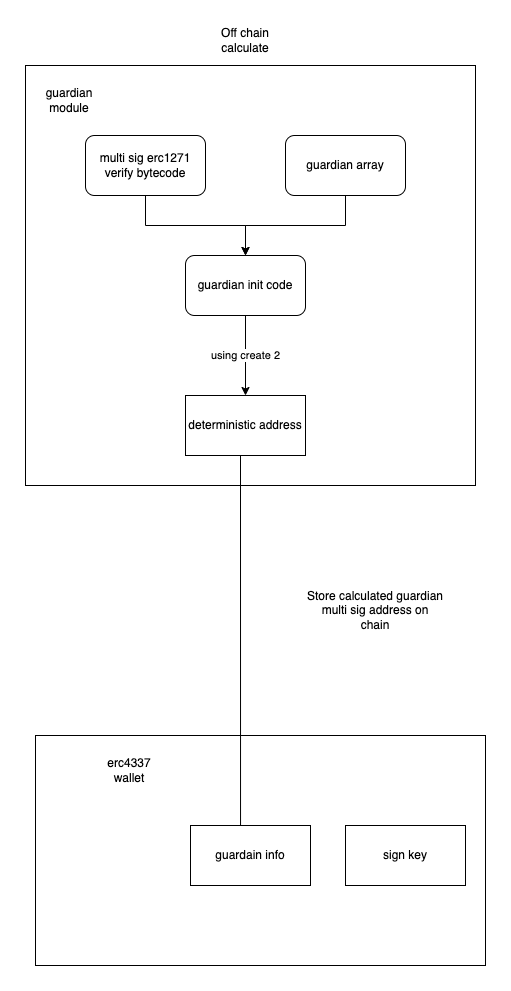
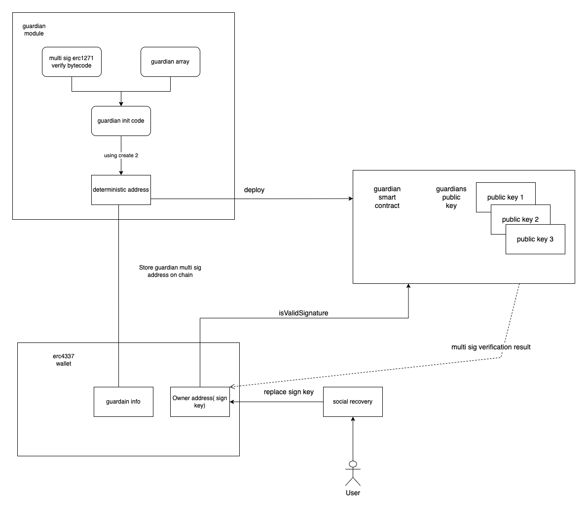

# Anonymous guardian with create2

## Why anonymous guardian

If the user has a lot of money and doesn't want their friends to know how much they have unless there is an emergency, they may not want to store the list of guardians on the blockchain because others can easily see the list, which would result in poor privacy.

## Related background

[Create deterministic contract address using create2](https://eips.ethereum.org/EIPS/eip-1014)

[Erc1271 Standard Signature Validation Method for Contracts](https://eips.ethereum.org/EIPS/eip-1271)

[Gnosis safe multi sig wallet](https://github.com/safe-global/safe-contracts/blob/c36bcab46578a442862d043e12a83fec41143dec/contracts/GnosisSafe.sol#L240)

## Goal achievement

- The identities of the smart contract guardians are not publicly known.
- Each guardian is unaware of the identities of the other guardians.
- The guardians are only revealed when recovery is needed.


## Implementation

### Add guardian

1. The Guardian module is a separate smart contract. The main functionality is a multi-sig wallet which stores the list of guardians for social recovery of the soul wallet.
2. This contract exposes the ```function isValidSignature(bytes calldata _data, bytes calldata _signature)``` **(ERC1271 interface)** to the public for signature verification.
3.  Inside the **isValidSignature** function, it accepts signatures which come from guardians and performs verification with a threshold, for example, a 3/5 or 4/7 multi-sig verification. [Gnosis code reference](https://github.com/safe-global/safe-contracts/blob/c36bcab46578a442862d043e12a83fec41143dec/contracts/GnosisSafe.sol#L240)


<p align="center">
  
</p>

### Using guardian for social recovery


1. When users want to replace the signing key using social recovery, the user needs to provide the guardian's list to the security center. The security center will generate the init code with the user-provided guardian list and compute the guardian multi-sig address by using singleton factory. The security center will give back the calculated address for the user to verify if the address is equal to the guardian address setting on the soul wallet contract.
2. Users will compose a ```transferOwner``` operation and ask guardians to sign it.
3. Once the user collects enough signatures from guardians, the user will send this ```transferOwner``` operation on the chain.
4. The soul wallet contract has a module called **GuardianControl** which includes a function called ```_validateGuardiansSignatureCallData```. This function deploys the Guardian Multi-Sig contract on the fly and then verifies the signature of the guardians using the function  ```isValidSignature(bytes calldata _data, bytes calldata _signature)```.
5. Inside the ```isValidSignature``` function in the Guardian Multi-Sig contract, the multi-sig check for the guardians is performed.
6. If all the checks are passed, the soulwallet smart contract will call the ```transferOwner``` function and replace the signing key with the new one.

<p align="center">
  
</p>
